<h1 align="center">Rumal Gunawardhana</h1>

  <strong>DevOps Engineer • Distributed Systems • Telecom • Backend Engineering • AI / LLM Engineering</strong>

  Building and operating systems from protocol traces and distributed services to Kubernetes clusters, backend APIs, and GPU training loops.

  
  
  
  

## About me

I am a **DevOps Engineer at Omobio** working across production infrastructure, distributed systems, telecom signalling, backend services, automation, and reliability engineering.

My strongest area is cross-layer troubleshooting. A production issue can begin in a packet capture, move through **M3UA → SCCP → TCAP → MAP**, appear inside a distributed Erlang service, touch Redis or MariaDB, and finally surface as an application or infrastructure problem. I enjoy following that path end to end and fixing the real failure rather than only the visible symptom.

I also build backend and full-stack systems with **Java and Spring Boot, Python, FastAPI, Go, React, Next.js, PostgreSQL, MongoDB, Redis, Docker, and Kubernetes**. Alongside production engineering, I am learning modern AI systems by building and training my own decoder-only language model in PyTorch.

## Engineering focus

| Area | What I work with |
| :--- | :--- |
| **Platform & Reliability** | Linux, RHEL, Kubernetes, Docker, Podman, CI/CD, observability, incident response, production recovery |
| **Distributed & Backend Systems** | Erlang/OTP, Java 21, Spring Boot, Spring Cloud, Python, FastAPI, Go, REST APIs, authentication, caching, microservices |
| **Telecom** | SMPP, SS7, SIGTRAN, SCTP, M3UA, SCCP, TCAP, MAP, SMSC, STP, HLR, MSC, SMS Firewall systems |
| **Data & Messaging** | MariaDB, PostgreSQL, MongoDB, Redis, Mnesia, ETS |
| **AI / LLM Engineering** | PyTorch, CUDA, tokenizers, transformer internals, training, evaluation, checkpointing, inference |
| **Frontend & Application Development** | React, Next.js, JavaScript, TypeScript, HTML, CSS, API integration |

## Tech stack

### Languages

  
  
  
  
  
  
  
  
  
  

### Backend & Web

  
  
  
  
  
  
  
  

### Infrastructure & DevOps

  
  
  
  
  
  
  
  
  
  

### Databases & Observability

  
  
  
  
  
  

### AI / ML

  
  
  
  

### Telecom & Signalling

  
  
  
  

## Featured projects

| Project | Stack | What it demonstrates |
| :--- | :--- | :--- |
| **[telco-signalling-lab](https://github.com/rumalg123/telco-signalling-lab)** | Go, SMPP, SCTP, M3UA, SCCP, TCAP, MAP | Multi-node telecom signalling lab with ESME, SMSC, STP, MSC and HLR components for routing, protocol testing and fault injection. |
| **[erlang-telco-test-lab](https://github.com/rumalg123/erlang-telco-test-lab)** | Erlang/OTP 29, SS7, SIGTRAN, SCTP | Component-based telecom core lab with an advanced STP implementation, OTP tests, container support and a roadmap for MSC, SMSC and HLR components. |
| **[SpringBoot-Microservice](https://github.com/rumalg123/SpringBoot-Microservice)** | Java 21, Spring Boot, Spring Cloud, Keycloak, PostgreSQL, Redis, Next.js, Docker | Full-stack microservice platform with API Gateway, Eureka discovery, role-based authentication, caching, rate limiting and multiple domain services. |
| **[Advanced-File-Filter-Bot](https://github.com/rumalg123/Advanced-File-Filter-Bot)** | Python, MongoDB, Redis, aiohttp, Docker | Asynchronous Telegram indexing, typo-tolerant search, quotas, recommendations, health checks, distributed media storage and operational controls. |
| **[2D-Simple-Game-Engine](https://github.com/rumalg123/2D-Simple-Game-Engine)** | C++17, OpenGL, ImGui, ECS, CMake | A 2D engine prototype with an editor, ECS scene model, sprite rendering, AABB physics, prefabs, JSON persistence, tests and packaged sample games. |

## Additional projects from my other GitHub account

I also maintain an older project history at **[@pachax001](https://github.com/pachax001)**. Selected original repositories include:

| Project | Stack | Focus |
| :--- | :--- | :--- |
| **[My-DramaList-Bot](https://github.com/pachax001/My-DramaList-Bot)** | Python 3.13, Redis, MongoDB, Docker | High-performance Telegram bot for MyDramaList and IMDb search with caching, user management, broadcasts, health monitoring and admin tooling. |
| **[JavaSpring-WebApp](https://github.com/pachax001/JavaSpring-WebApp)** | Java 21, Spring Boot, Spring Security, PostgreSQL, JWT, Docker | Role-based REST API with authentication, post workflows and PostgreSQL persistence. |
| **[FOURDIV Test System](https://github.com/pachax001/FOURDIV-Test-Backend)** + **[Frontend](https://github.com/pachax001/FOURDIV-Test-Frontend)** | Spring Boot, JPA, PostgreSQL, React, Vite | Full-stack backend and frontend project built around a Java REST service and React client. |
| **[Ticketing System](https://github.com/pachax001/Ticketing-Backend)** + **[Frontend](https://github.com/pachax001/Ticketing-FrontEnd)** | Spring Boot, Spring Security, PostgreSQL, JWT, React, Vite | Ticketing application with secured Java backend and React frontend. |
| **[Python-Fast-API](https://github.com/pachax001/Python-Fast-API)** | FastAPI, Motor, bcrypt, JWT, Docker | Python API project using asynchronous MongoDB access, authentication and containerized deployment. |

## Current build: RumalGPT

I am building **RumalGPT**, a decoder-only language model from scratch in PyTorch to understand LLM engineering from first principles.

The project covers the complete path from **dataset construction and BPE tokenization to transformer architecture, CUDA training, validation, checkpointing, generation and benchmarking**. Current experiments include RoPE, RMSNorm, SwiGLU, causal attention, tied embeddings, deterministic training and resumable checkpoints.

The goal is not only to use language models. It is to understand how they work, how they fail, and what changes when the model, dataset, context window and compute budget scale.

## GitHub activity

  
  

  Cards are generated automatically from public activity on <a href="https://github.com/rumalg123">@rumalg123</a>.

## How I approach engineering

1. Understand the system before changing it.
2. Reproduce and measure instead of guessing.
3. Automate repetitive operational work.
4. Design for failure, recovery and observability.
5. Verify changes with tests, logs, metrics, traces or packet captures.
6. Keep learning one layer deeper.

## Currently going deeper into

**Distributed Erlang/OTP • telecom protocol internals • Kubernetes architecture • reliability engineering • distributed systems • backend architecture • transformer internals • LLM training • GPU optimization • RAG and AI systems**

## Connect

  <a href="https://rumalg.me/">Portfolio</a>
  &nbsp;•&nbsp;
  <a href="https://www.linkedin.com/in/rumal-gunawardana/">LinkedIn</a>
  &nbsp;•&nbsp;
  <a href="https://github.com/rumalg123">Primary GitHub</a>
  &nbsp;•&nbsp;
  <a href="https://github.com/pachax001">Additional Projects</a>

  <i>I like building systems, breaking them in controlled environments, understanding why they broke, and making the next version harder to break.</i>

